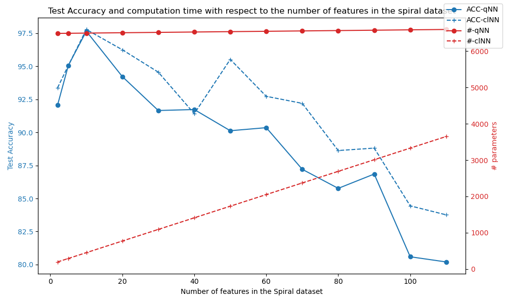
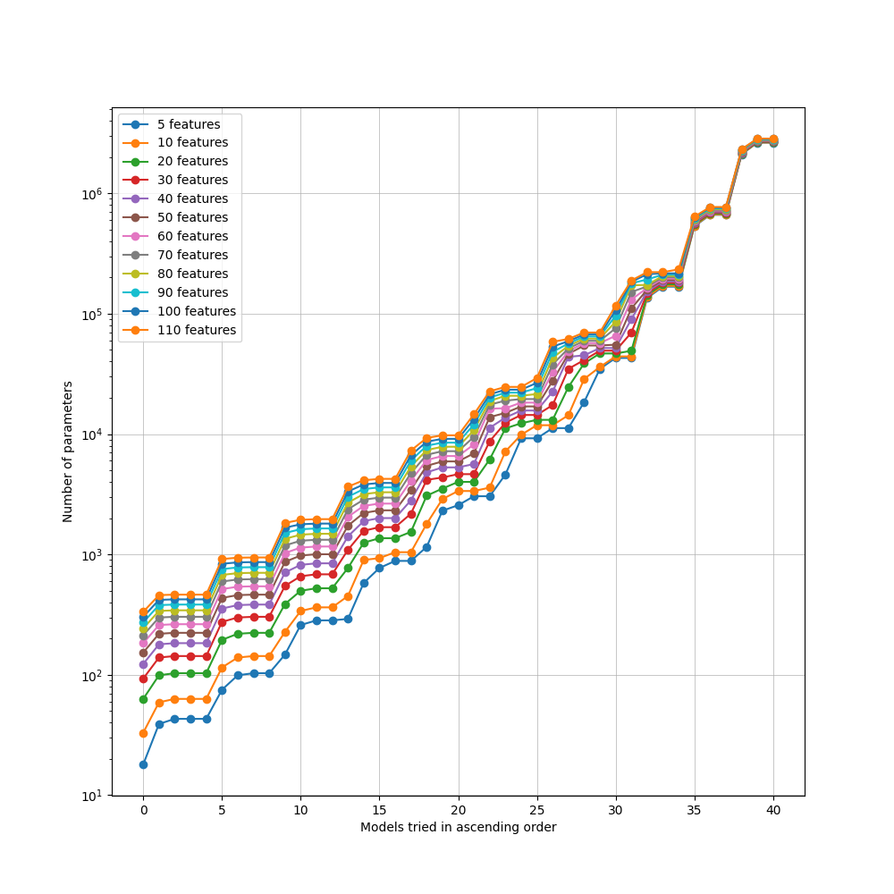
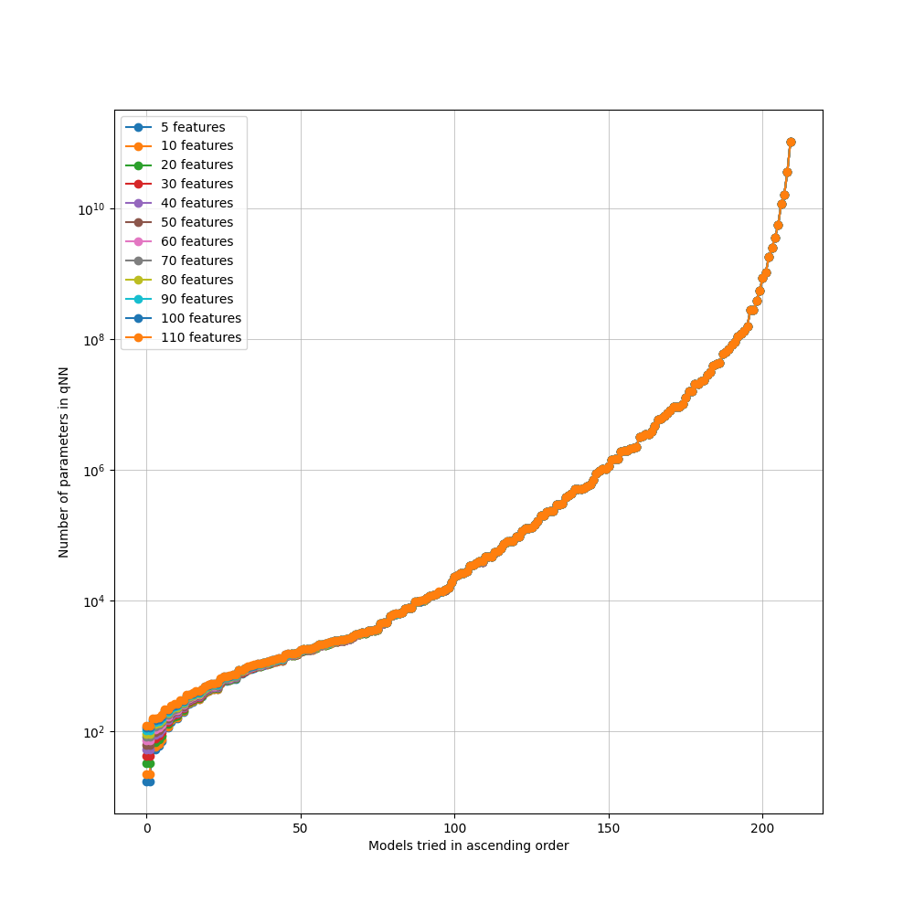
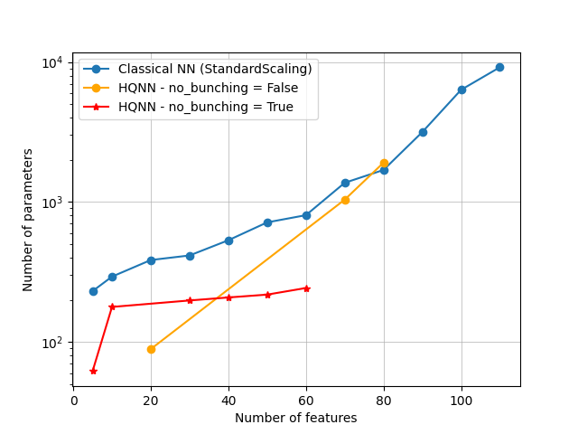

# Reproduction of the work: "Computational Advantage in Hybrid Quantum Neural Networks: Myth or Reality?", by Kashif et al.

Here, we reproduce the experiments presented in the following paper [Computational Advantage in Hybrid Quantum Neural Networks: Myth or Reality?](https://arxiv.org/abs/2412.04991)

### The dataset
The original paper mentions the following dataset: _"We generate a spiral dataset with 1500 data points distributed across 3 classes. The dataset’s core structure is a spiral, as shown in Fig. 4(a) with each class represented by a distinct arm, offering a challenging yet learnable pattern for models. To investigate the effect of task complexity, we maintain a fixed number of data points and classes while systematically increasing complexity by augmenting the number of features. The increase in feature dimensions is accompanied by a corresponding increase in noise, further enhancing the complexity of the dataset. Specifically, the additional features introduce subtle variations through non-linear transformations of the existing features. Controlled noise is introduced, scaled with the number of features (noise = 0.1 + 0.003 × num f eatures), ensuring a progressive rise in task difficulty. We utilize feature sizes ranging from 10 to 110 in increments of 10"_

Here is the dataset that we generated

And we can observe that the complexity increases with the number of features as the performance of fixed classical neural networks (NN) and Hybrid Quantum NN (HQNN) decrease:


### The classical Neural Networks
The original paper mentions the following classical models: _"We restrict the classical models to have a maximum of n = 3 layers, with the number of neurons in each layer chosen from the set m = {2, 4, 6, 8, 10} resulting in a search space of total 155 model combinations for classical models for each complexity level."_

Here, we implement the same models but it seems that our biggest model cannot classify with at least 90% of accuracy the spiral dataset with more than 70 features.ç
We increase the search space to more neurons in hidden layers, up to 256.
The search space looks as follows:


To run the classical experiments ```python3 classical_NN_spiral.py``` 

### The Hybrid Quantum Neural Networks
The original paper mentions: _"During the hybrid model search only the quantum layers are varied. We use [3, 4, 5] qubits quantum layers, and for each qubit size, quantum layers of depth [1, 2, 3, ..., 10] are tested, yielding 30 model combinations per feature size."_

For the photonic implementation, we use network from 2 to 24 modes with 1 photon up to modes/2 photons. We use bunching and no bunching modes.
The search space looks as follows:


To run the HQNN experiments ```python3 HQNN_spiral.py``` 

### Results
So far, the results we obtained for the parameter counts are as follows:

