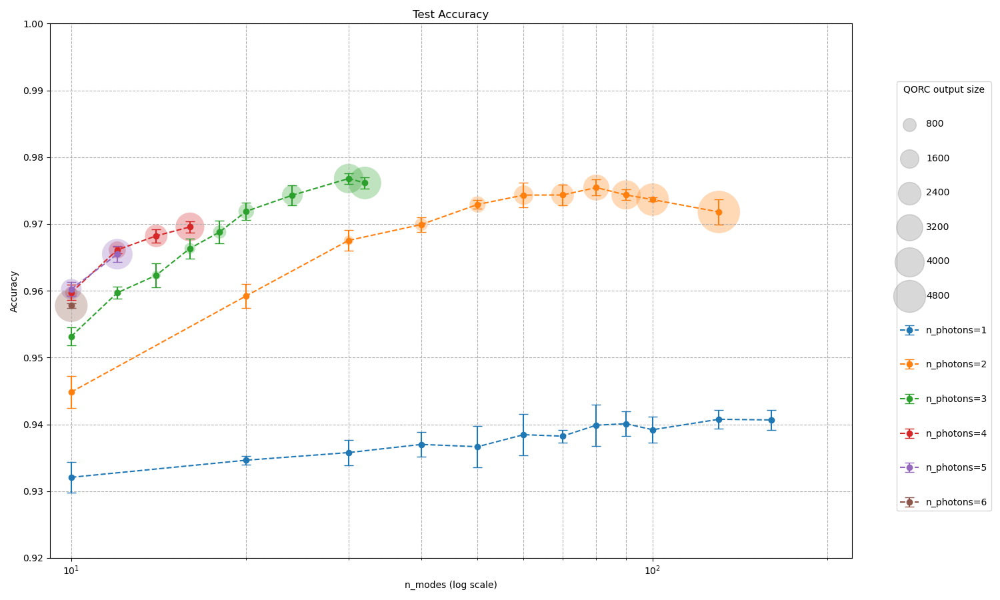
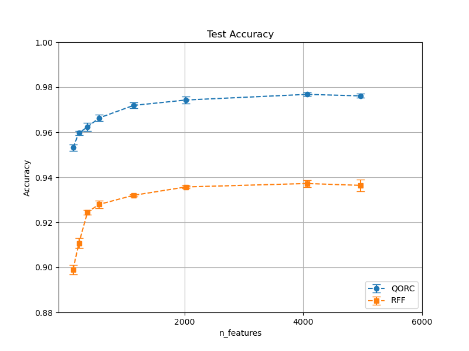

# Reproduction of [Quantum optical reservoir computing powered by boson sampling](https://opg.optica.org/opticaq/abstract.cfm?URI=opticaq-3-3-238)

## Reference and Attribution

- Paper: Quantum optical reservoir computing powered by boson sampling (Optica Quantum, 2025)
- Authors: Akitada Sakurai, Aoi Hayashi, William John Munro, Kae Nemoto
- DOI/ArXiv: https://doi.org/10.1364/OPTICAQ.541432, https://opg.optica.org/opticaq/abstract.cfm?URI=opticaq-3-3-238
- License and attribution notes:

## Overview

This repository provides a reproducible implementation of the **quantum reservoir computing (QRC) experiment** using the **MerLin quantum machine learning framework**. The code replicates the performance results of quantum feature-based classification on the **MNIST dataset**, demonstrating the proof-of-concept advantages of quantum reservoirs in machine learning tasks.

### Key Components
- **Dataset**: Classic MNIST (10-class image classification, 28x28 pixels, 60,000 training + 10,000 test images).
- **Models**:
  - **QORC (Quantum Optical Reservoir Computing)**:
    - **Nb photons and modes**: To be selected by the user.
    - **Pre-circuit and Reservoir circuits**: Both use the same Haar-random unitary matrix representation.
    - **Input State**: Photons are distributed over modes.
    - **Training**: Only the linear classifier is trained; circuit parameters are fixed.
    - **Bunching Control**: Configurable (with `b_no_bunching`).
    - **Dimensionality Reduction**: PCA applied to MNIST images before feeding into QORC.
    - **Optimizer**: AdaGrad with cross-entropy loss and Xavier Glorot weight initialization.
    - **Learning Strategy**: `ReduceLROnPlateau` with gradient clipping (norm=1.0) for stability.
    - **Normalization**:
      - MNIST: Scaled to `[0, 1]` by dividing by 255.
      - PCA: Global min-max normalization to preserve variance ratios.
      - QORC features: StandardScaler.
  - **RFF (Random Fourier Features)**:
    - **Features**: RBF kernel with configurable bandwidth (`sigma`) and number of components.
    - **Optimizer**: SGD or `LinearSVC` (hinge loss).
    - **Normalization**: StandardScaler for both MNIST and RFF features.

### Technical Choices
- **Hardware**: Compatible with CPU and GPU (`device: cpu/cuda:0`).
- **Reproducibility**: Seed control for all random number generators (RNGs). Set `seed=-1` for random behavior; positive seeds ensure determinism.
- **Training**:
  - **QORC**: Uses train/val split with k-fold cross-validation (default: 5 folds). Validation set is only used for model selection.
  - **RFF**: Configurable via SGD or direct `LinearSVC` optimization.
- **Logging**: TensorBoard support and computation duration tracking for benchmarking.
- **No Data Augmentation**: Not required for this proof-of-concept.
- **Looping**: Supports automated iteration over parameter ranges (e.g., n_photons, n_modes) for batch experimentation.

### Deviations/Assumptions
- **Circuit Design**: Pre-circuit and reservoir share the same Haar-random unitary matrix, as in the original paper.
- **Determinism**: Fully deterministic when `seed > 0`. Random behavior if `seed=-1`.

## Concept

**Quantum Optical Reservoir Computing (QORC)** leverages the intrinsic non-linearity of photonic circuits to compute high-dimensional, untrained features. A trainable linear layer is then applied to these features to perform image classification.


In detail, an **M-mode random interferometer** (pre-circuit) with **N single-photon inputs** generates a complex photonic resource state. Each input image undergoes **dimensionality reduction via Principal Component Analysis (PCA)**, and the resulting feature vector modulates the phases of a column of phase shifters, encoding the data into the photonic state. The encoded state is subsequently processed through a second **M-mode random interferometer** (the reservoir), which may be identical to the pre-circuit. The output **Fock-state probabilities**, obtained via coincidence detection, serve as quantum-derived features for classification.

## How to Run

### Install dependencies

```bash
python -m venv .venv
source .venv/bin/activate
pip install -r requirements.txt
```

### Command-line interface

Main entry point: `implementation.py`

```bash
python implementation.py --help
```

### General Options
   Option               | Description                                                                 |
 |----------------------|-----------------------------------------------------------------------------|
 | `--config PATH`      | Load config from JSON (example files in `configs/`).                        |
 | `--outdir DIR`       | Base output directory. A timestamped run folder `run_YYYYMMDD-HHMMSS` is created inside. |

### Qorc Options
 | Option               | Description                                                                 |
 |----------------------|-----------------------------------------------------------------------------|
 | `--n-photons INT`    | Number of photons.                                                          |
 | `--n-modes INT`      | Number of modes.                                                            |
 | `--seed INT`         | Random seed for reproducibility.                                            |
 | `--fold-index INT`   | Split train/val fold index.                                                 |
 | `--n-fold INT`       | Number of folds for train/val split.                                        |
 | `--epochs INT`       | Number of training epochs.                                                  |
 | `--batch-size INT`   | Batch size.                                                                 |
 | `--lr FLOAT`         | Learning rate.                                                              |
 | `--reduce-lr-patience INT` | Patience for reducing learning rate on plateau.                     |
 | `--reduce-lr-factor FLOAT` | Factor by which the learning rate will be reduced.                  |
 | `--num-workers INT`  | Number of subprocesses for data loading.                                   |
 | `--pin-memory BOOL`  | Enable pin memory for faster data transfer to CUDA devices.                |
 | `--f-out-weights PATH` | Filepath to save the model checkpoint.                              |
 | `--b-no-bunching BOOL` | Disable bunching.                                                          |
 | `--b-use-tensorboard BOOL` | Enable TensorBoard logging.                                          |
 | `--device STR`       | Device string (e.g., `cpu`, `cuda:0`, `mps`).                              |

### RFF Options
 | Option               | Description                                                                 |
 |----------------------|-----------------------------------------------------------------------------|
 | `--n-rff-features INT` | Number of Random Fourier Features.                                         |
 | `--sigma FLOAT`      | RBF kernel bandwidth.                                                       |
 | `--regularization-c FLOAT` | Regularization strength (C).                                        |
 | `--b-optim-via-sgd BOOL` | Use SGD for optimization.                                           |
 | `--max-iter-sgd INT` | Maximum number of SGD iterations.                                          |


Example runs:

```bash
# To run the default qorc experiment
python implementation.py --config configs/xp_qorc.json

# To run the default RFF experiment
python implementation.py --config configs/xp_rff.json

# Override some parameters inline
python implementation.py --config configs/xp_qorc.json --epochs 50 --lr 1e-3
```


To reproduce the graphs:

```bash
# To plot the main graph
$ python utils/draw_main_graph.py

# To plot the graph comparing qorc and rff
python utils/draw_graph_qorc_vs_rff.py
```

The script saves a snapshot of the resolved config alongside results and logs.

### Output directory and generated files

At each run, a timestamped folder is created under the base `outdir` (default: `outdir`):

```
<outdir>/run_YYYYMMDD-HHMMSS/
├── config_snapshot.json                    # Resolved configuration used for the run
├── run.log                                 # Log output (stdout/stderr)
├── f_out_results_training_{qorc,rff}.csv   # Training metrics (accuracy, duration, etc.)
│                                           # Example: `f_out_results_training_qorc.csv`
└── f_weights_out.pth                       # Trained model weights (linear layer)
```

Note:
- Change the base output directory with `--outdir` or in `configs/example.json` (key `outdir`).

## Configuration

Place configuration files in `configs/`.

- **`xp_qorc.json`**: Defines the structure and default parameters for the **QORC experiment**.

- **`xp_rff.json`**: Defines the structure and default parameters for the **RFF experiment**.

- Typical keys for the QORC experiment include n_photons, n_modes, seed, n_epochs, batch_size, and learning_rate, while the RFF experiment includes keys such as n_rff_features.

- **Looping Support**: Some parameters can be provided as lists (e.g., `n_photons`, `n_modes`, `seed`, `fold_index`, `n_rff_features`). In such cases, the script will automatically loop over all provided values **in a grid-search manner**.


## Results and Analysis

Main graph exposing quantum reservoir performances (test accuracy) on MNIST.



In the precedent graph, bunching was manually disabled when the condition `n_photons * n_photons < n_modes` was met, to ensure more precise calculations. The results obtained are comparable to those reported in the reference paper.

Graph comparing the quantum reservoir computing (QRC) method with the classical Random Fourier Features (RFF) method, a fast approximation of the Radial Basis Function (RBF) kernel. For the QRC, the number of photons is fixed at 3, as specified in the reference paper.




## Extensions and Next Steps

- **Circuit Depth Ablation**: Study how test accuracy evolves with deeper/shallower quantum circuits.
- **Robustness**: Evaluate performance on **Fashion-MNIST** and **K-MNIST**.
- **Photon/Mode Scaling**: Evaluate performance with higher photon counts and mode dimensions, leveraging HPC resources (e.g., GENCI/Jean Zay) for large-scale simulations.


## Reproducibility Notes

### Random Seed Control
- Set `seed` to a positive integer for full determinism.
- `seed=-1` disables control (random behavior).

### Determinism Settings
- All RNGs (NumPy, PyTorch, Perceval) are seeded if `seed > 0`.

### Library Versions
```bash
numpy==2.3.3
scikit_learn==1.7.1
pandas==2.3.1
torch==2.7.1
perceval_quandela==0.13.2
merlinquantum==0.1.0
```

