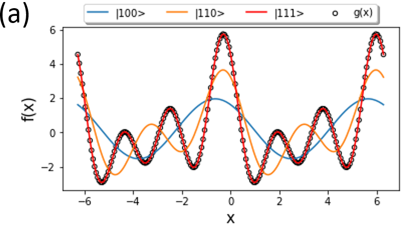
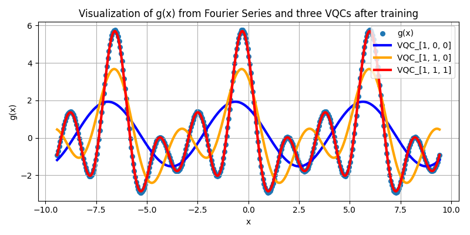
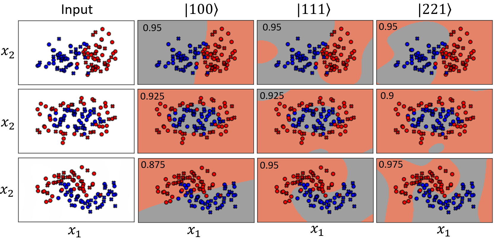
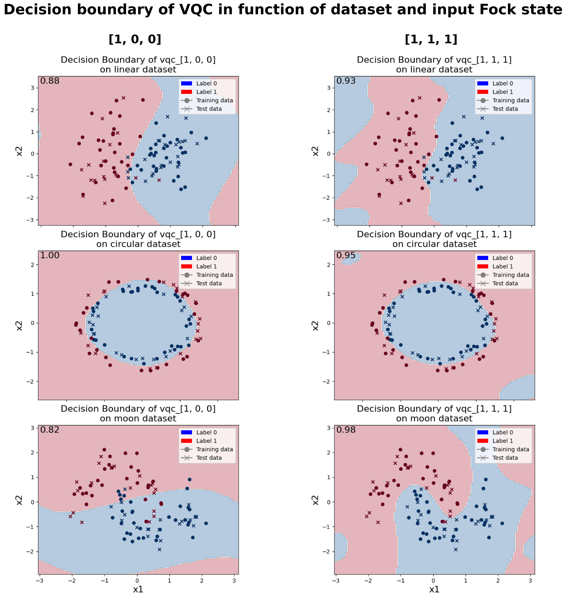
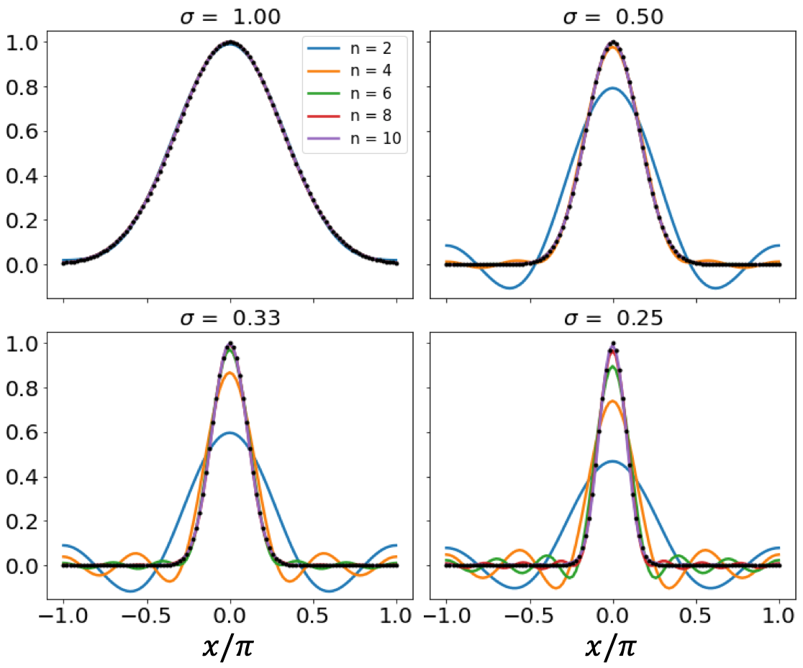
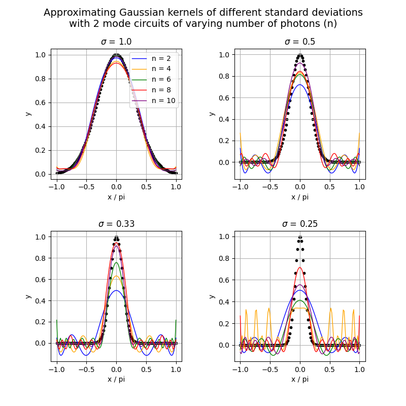
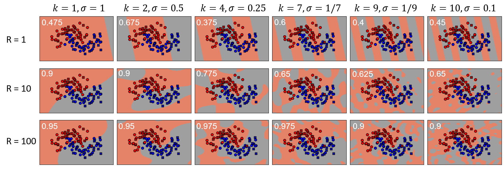
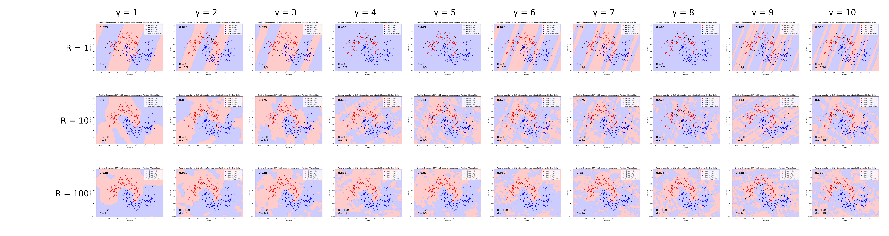

# Reproduction of [Fock state-enhanced expressivity of quantum machine learning models](https://arxiv.org/abs/2107.05224)
By Beng Yee Gan, Daniel Leykam, Dimitris G. Angelakis
## Description
This paper proposes a data encoding scheme for photonic quantum circuits. It elaborates on the theory behind its choice and present a small experiment to validate it. In addition, it presents three binary classification algorithms that utilize the presented encoding. This reproduction focuses on the four experiments displayed in this paper:
1. Theory validation experiment: Expressivity of variational quantum circuit (VQC) on a Fourier series fitting task
2. Algorithm 1: Linear quantum photonic circuits as variational quantum classifiers
3. Algorithm 2: Linear quantum photonic circuits as Gaussian kernel samplers
4. Algorithm 3: Quantum-enhanced random kitchen sinks

All our reproductions are separated by section in their respective folders:
1. ./VQC_fourier_series/
2. ./VQC_classif/
3. ./q_gaussian_kernel/
4. ./q_rand_kitchen_sinks/

The frameworks used for reproduction were [Perceval](https://perceval.quandela.net) and [MerLin](https://merlinquantum.ai). 

Perceval is a Python API that provides all the tools for creating and manipulating circuits from linear
optical components. That makes Perceval an ideal companion for developing photonic circuits, running
simulations and even accessing quantum hardwares.

MerLin is a framework which allows to define derivable quantum layers to use and optimize in the exact
same manner as any classical layer with PyTorch. This integration of
quantum components into machine learning is very intuitive and it was optimized for GPU simulations
on the cuda level too.

## Paper overview and results
The most important result from this paper, that is validated from three of the four experiments conducted, is that with the proposed data encoding scheme, increasing the number of photons that go through the circuit increases its expressivity.

The paper does not conclude much on the three algorithms it presents. Instead, the authors thought that these algorithms would serve as inspiration or as a base to develop other quantum machine learning (QML) algorithms that possess quantum advantage.

Here are some more specific results, presented in figures that we have reproduced accurately, for the most part.

1. Fitting of VQC on Fourier series

Theirs:

Ours:

2. Algo 1: VQC for classification

Theirs:

Ours:

3. Algo 2: Quantum Gaussian kernel sampler

Theirs:

Ours:

4. Algo 4: Quantum random kitchen sinks

Theirs:

Ours:

## Usage
For usage, refer to the README inside of every section folder for information on its respective content.

## Roadmap
In the future, one goal for this reproduction would be to explain why are our Gaussian kernel fits are less accurate than the ones presented in the paper (Algo 2: Quantum Gaussian kernel sampler) and fix this issue.

## Further content
For anyone interested, a complete report about this implementation was conducted and is available [here](https://files.quandela.com/index.php/s/kDTGmaF5HijSRxs).
