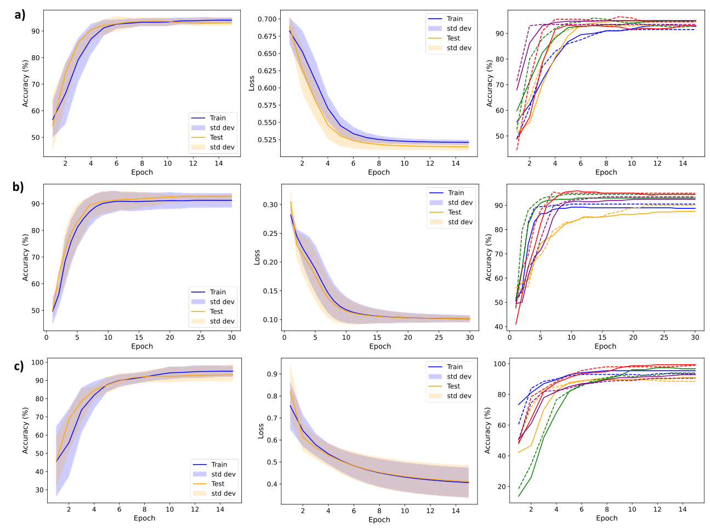
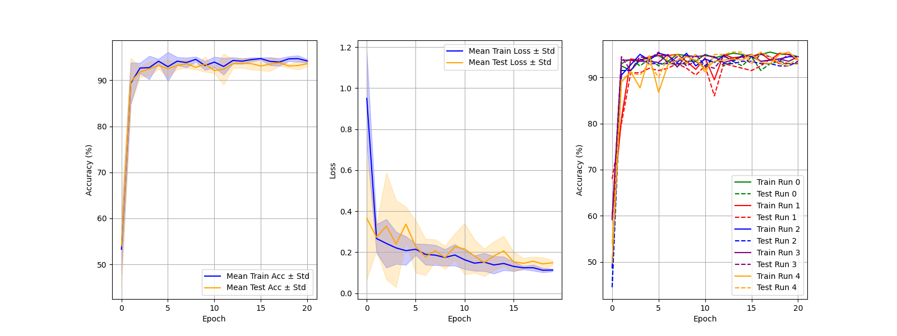
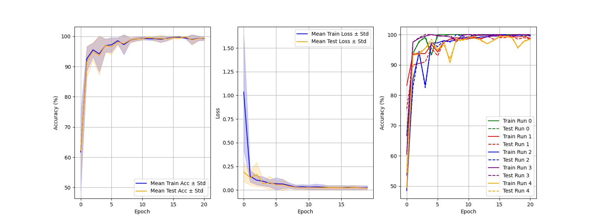
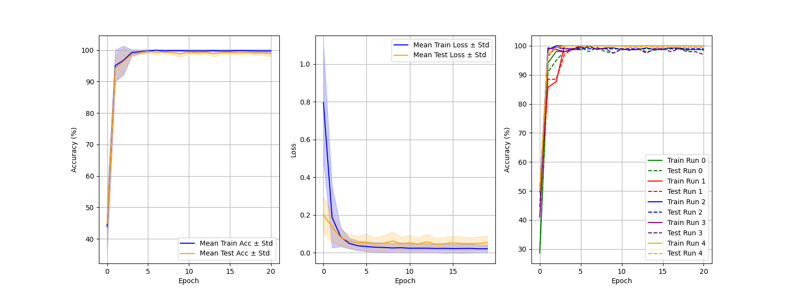
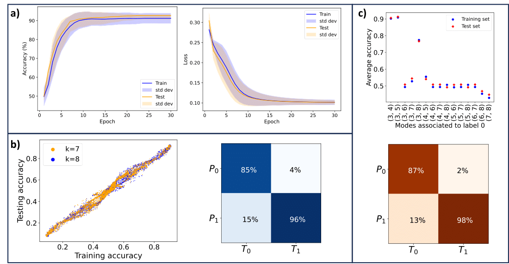
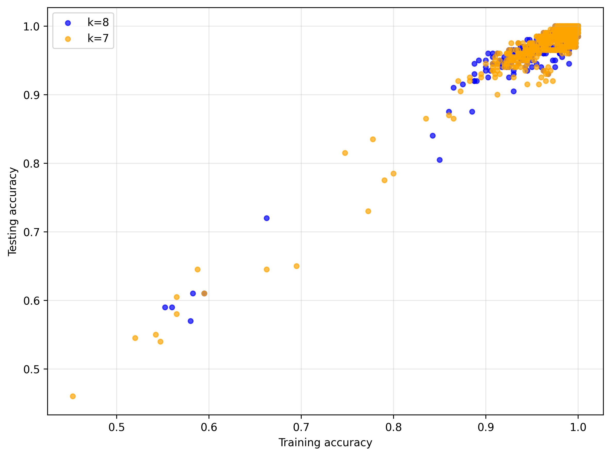
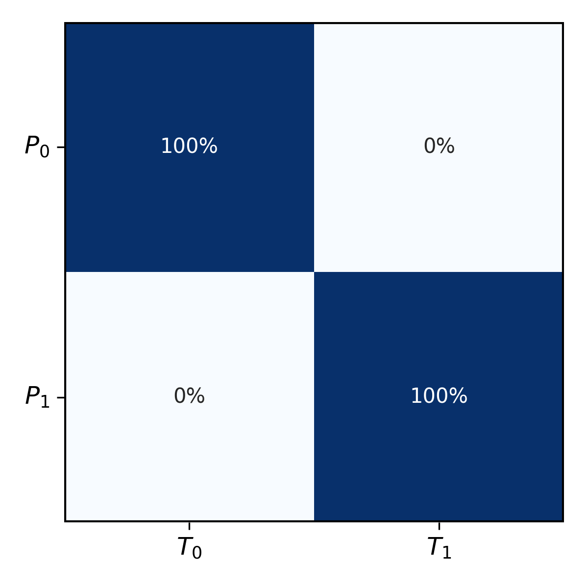
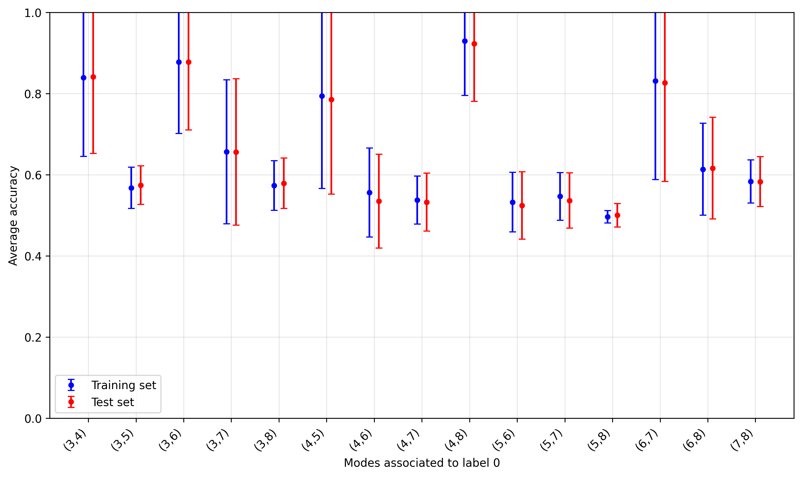
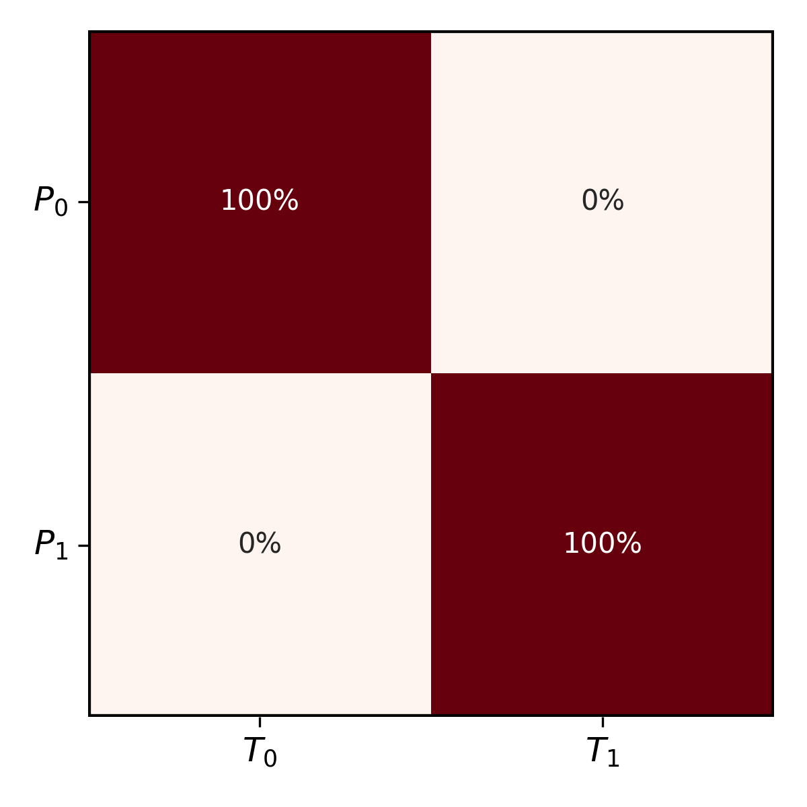

# Reproduction of [Photonic Quantum Convolutional Neural Networks with Adaptive State Injection](https://arxiv.org/abs/2504.20989)
By Léo Monbroussou, Beatrice Polacchi, Verena Yacoub, Eugenio Caruccio, Giovanni Rodari, Francesco Hoch, Gonzalo Carvacho, Nicolò Spagnolo, Taira Giordani, Mattia Bossi, Abhiram Rajan, Niki Di Giano, Riccardo Albiero, Francesco Ceccarelli, Roberto Osellame, Elham Kashefi, Fabio Sciarrino

Note that the implementation from the paper is available [here](https://github.com/ptitbroussou/Photonic_Subspace_QML_Toolkit) and we have taken some of their code directly to be able to run their version of the photonic QCNN. We have also modified some of their code for easier use or to enhance performance.

## Description
This paper proposes an Photonic Quantum Convolutional Neural Network (PQCNN) architecture using state injection to preserve the number of photons on the circuit while reducing the circuit dimensionality. Their architecture can be divided in 5 sections:
1. Data loading on the circuit
2. Convolutions
3. Pooling
4. Dense network
5. Measurement

Then, three binary classification experiments are conducted on different datasets:
1. Bars and Stripes (BAS): 4x4 images
2. Custom Bars and Stripes (Custom BAS): 4x4 images
3. Binary MNIST 0 vs 1: 8x8 images

The results from these classification tasks are presented in Table III (number of parameters, accuracies) and in Figure 12 (losses, accuracies) of the original paper.

Additionally, they conduct experiments on the training of the readout layer (measurement layer) to analyze which strategy is the best. They consider two approaches for which the results are respectively presented in Figure 4 b) and c) of their paper.

The frameworks used for our reproduction were [Perceval](https://perceval.quandela.net) and [MerLin](https://merlinquantum.ai). 

Perceval is a Python API that provides all the tools for creating and manipulating circuits from linear
optical components. That makes Perceval an ideal companion for developing photonic circuits, running
simulations and even accessing quantum hardwares.

MerLin is a framework which allows to define derivable quantum layers to use and optimize in the exact
same manner as any classical layer with PyTorch. This integration of
quantum components into machine learning is very intuitive and it was optimized for GPU simulations
on the cuda level too.

## Paper overview and results
The paper discusses the great scaling of their proposed architectures regarding the required resources. It also reports 
the number of parameters of their model on the three different datasets as well as their attained training and test 
accuracies:

| Dataset        | Input Size | # Parameters | Train Acc    | Test Acc     |
|----------------|------------|--------------|--------------|--------------|
| BAS            | 4x4        | 10           | 93.7 ± 1.6 % | 93.0 ± 1.2 % |
| Custom BAS     | 4x4        | 10           | 91.3 ± 2.6 % | 92.7 ± 2.1 % |
| MNIST (0 vs 1) | 8x8        | 30           | 95.1 ± 2.9 % | 93.1 ± 3.6 % |

Through additional hyperparameter optimization, we have been able to improve the accuracy of their model (using their code) on Custom BAS and MNIST:

| Dataset        | Input Size | # Parameters | Train Acc     | Test Acc     |
|----------------|------------|--------------|---------------|--------------|
| Custom BAS     | 4x4        | 10           | 97.3 ± 1.6 %  | 98.2 ± 2.0 % |
| MNIST (0 vs 1) | 8x8        | 30           | 100.0 ± 0.0 % | 97.2 ± 1.3 % |

Additionally, our own implementation of their model using MerLin has reached equivalent accuracies:

| Dataset        | Input Size | # Parameters | Train Acc    | Test Acc     |
|----------------|------------|--------------|--------------|--------------|
| BAS            | 4x4        | 10           | 94.7 ± 1.0 % | 93.0 ± 1.1 % |
| Custom BAS     | 4x4        | 10           | 98.4 ± 1.9 % | 98.2 ± 2.2 % |
| MNIST (0 vs 1) | 8x8        | 30           | 99.7 ± 0.5 % | 98.8 ± 1.0 % |

Moreover, they reported their simulation results on BAS, Custom BAS and MNIST through the following figure at a), b) and c) respectively:



Comparatively, here are our respective simulation results:





Then, the first approach considered for the readout (measurement) layer was the clustering of all possible two-photons measurements in two groups for the two labels. This approach was tested on the Custom BAS dataset and led to the results at section b) of the following figure. The second approach, to associate a single pair of modes to label 0, led to the results at section c) of the same figure.



We have also implemented these two approaches and the results are the following:

First approach:





Second approach:





## Usage
For general usage, refer to the following script from the photonic_QCNN directory.
```bash
# Run the paper implementation
python3 main.py --paper

# Run the MerLin implementation
python3 main.py --merlin
```

For interactive example:
```bash
jupyter notebook photonic_QCNN.ipynb
```

For more specific usage and more customization, modify and run the following files:
```bash
# Run the paper implementation on BAS dataset
python3 runs/run_BAS_paper.py

# Run the MerLin implementation on BAS dataset
python3 runs/run_BAS.py

# Run the paper implementation on Custom BAS dataset
python3 runs/run_custom_BAS_paper.py

# Run the MerLin implementation on Custom BAS dataset
python3 runs/run_custom_BAS.py

# Run the paper implementation on MNIST dataset
python3 runs/run_MNIST_paper.py

# Run the MerLin implementation on MNIST dataset
python3 runs/run_MNIST.py
```

To reproduce Figure 12 from the paper of reference, you first have to run the MerLin version of the PQCNN and then, run this:
```bash
python3 results/simulation_visu.py
Enter the path to detailed_results.json:  # detailed_results.json file path from the MerLin version of the PQCNN for whichever dataset
```

Finally, you can also reproduce Figure 4. b) and c) which display the results from the readout training analysis.

To reproduce Figure 4. b), the first readout training strategy:
```bash
# Run all configurations of two_fold readouts for k = 7
python3 runs/run_two_fold_readout.py
Enter the number of modes pairs to associate to label 0 (7 or 8):

# Run all configurations of two_fold readouts for k = 8
python3 runs/run_two_fold_readout.py
Enter the number of modes pairs to associate to label 0 (7 or 8):

# Visualize the results
python3 results/readout_visu.py --first
Enter the path to first_readout_detailed_results_k_7.json: 
Enter the path to first_readout_detailed_results_k_8.json: 
```

To reproduce Figure 4. c), the second readout training strategy:
```bash
# Run all configurations of modes pair readout for 30 different reshuffling of the data each
python3 runs/run_modes_pair_readout.py

# Visualize the results
python3 results/readout_visu.py --second
Enter the path to second_readout_detailed_results.json: 
```

## Roadmap
Future work on this topic would include a benchmarking of this architecture.
Another avenue is to implement the model on hardware to see how it compares with its simulation version.
This would align with Figure 3 from the reference paper which showcases the outcome versus the expected results for each stage of the PQCNN.
Note that this current implementation cannot take multi-channel images but we have implemented a PQCNN which can handle these types of images (just not in this repository).

## Dependencies

This project requires the following dependencies:

### Core Libraries
- **PyTorch**: Deep learning framework for tensor operations and automatic differentiation
- **NumPy**: Numerical computing library for array operations
- **Matplotlib**: Plotting and visualization for training metrics
- **tqdm**: Progress bars for training loops
- **scikit-learn**: Machine learning utilities and datasets

### Quantum Computing Frameworks

#### For MerLin Implementation
- **Perceval**: Python API for photonic quantum computing circuits and simulations
- **MerLin**: Framework for hybrid quantum-classical machine learning with GPU optimization

#### For Paper Implementation  
- **PennyLane**: Quantum machine learning library for loading datasets
- **qoptcraft**: Quantum optical circuit simulation and optimization

### Data Handling
- **H5py**: HDF5 file format support for datasets
- **pickle**: Python object serialization for custom datasets

## Hyperparameters

The model uses the following key hyperparameters across different experiments:

### Training Parameters
- **Learning Rate**: 0.1 (with Adam optimizer)
- **Weight Decay**: 0.001
- **Scheduler**: Exponential decay with γ=0.9
- **Epochs**: 20
- **Batch Size**: 6
- **Loss Function**: CrossEntropyLoss

### Model Architecture Parameters
- **Kernel Size**: 2×2 for convolution and pooling
- **Stride**: 2 (same as kernel size)
- **Circuit Types**:
  - Convolution: 'MZI' (Mach-Zehnder Interferometer) or 'BS' (Beam Splitter)
  - Dense: 'MZI', 'BS', or 'paper_6modes' (paper-specific circuit)
- **Additional Modes**: 2 modes inserted in dense layer for improved expressivity
- **Measurement Subset**: 2 modes measured (partial measurement)

### Output Formatting Options
- **'Train_linear'**: Trainable linear layer for classical post-processing
- **'No_train_linear'**: Fixed linear layer (no gradient updates)
- **'Lex_grouping'**: Lexicographic grouping of quantum measurement outcomes
- **'Mod_grouping'**: Modular grouping of quantum measurement outcomes

### Probability Output Types
- **'state'**: Use full Fock state probability distributions
- **'mode'**: Use marginalized per-mode occupation probabilities
