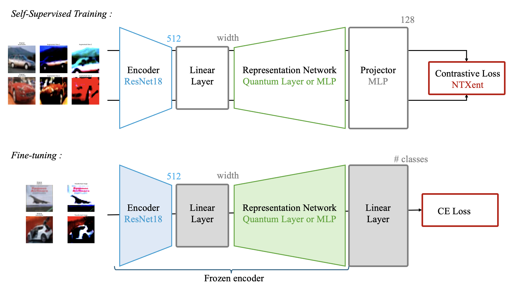

# Quantum Self-Supervised Learning (qSSL)

## Overview

This project reproduces the results from ["Quantum Self-Supervised Learning"](https://arxiv.org/abs/2103.14653) by Jaderberg et al. (2022). The implementation compares classical and quantum self-supervised learning methods using a contrastive learning approach.

## Goal

The script implements a quantum self-supervised learning framework with the following components:
- **Backbone**: ResNet18 with compression layer (output width: 8)
- **Representation Network**: Either classical (2-layer MLP) or quantum (Qiskit circuit based on [Jaderberg et al.](https://github.com/bjader/QSSL) and MerLin)
- **Loss Function**: InfoNCE contrastive loss (NT-Xent)
- **Dataset**: CIFAR-10 subset (first 2-5 classes)

## Concept

The quantum self-supervised learning framework combines classical deep learning with quantum computing to learn meaningful representations from unlabeled data. The architecture consists of two main phases:

### Self-Supervised Pre-Training Phase
- **Encoder (ResNet18)**: Extracts features from augmented image pairs to 512-dimensional vectors
- **Linear Compression**: Reduces dimensionality to the specified width (default: 8 dimensions)
- **Quantum/Classical Representation Network**: The core differentiator between quantum and classical approaches:
  - **Classical**: Standard 2-layer MLP
  - **Quantum (MerLin)**: Photonic quantum circuit using Perceval framework
  - **Quantum (Qiskit)**: Gate-based quantum neural network with parameterized circuits
- **Projector MLP**: Maps representations to loss space (default: 128 dimensions)
- **Contrastive Loss (InfoNCE/NT-Xent)**: Learns to distinguish between similar and dissimilar image pairs

### Linear Evaluation Phase
- **Frozen Encoder + Representation Network**: Pre-trained features are kept fixed
- **Linear Classifier**: Simple linear layer trained for downstream classification
- **Cross-Entropy Loss**: Standard supervised loss for classification

The quantum advantage is hypothesized to emerge from the quantum representation network's ability to encode and process information in superposition states, potentially capturing more complex feature relationships than classical networks.

<div align="center">
  
</div>

## Results
| Number of epochs | Number of classes (CIFAR10) | Qiskit based | Classical SSL | Quantum SSL (no_bunching=False) | Quantum SSL (no_bunching=True) |
|------------------|----------------------------|----------|--------------|----------------------------------|--------------------------------|
| 2 | 5 | 48.37    | 48.08 | 8 modes: 49.22<br>10 modes: 47.28<br>12 modes: 46.46 | 8 modes: 45.58<br>10 modes: 45.58<br>12 modes: 45.76 |
| 5 | 5 | 47.8     | 49.04 | 8 modes: 49.9<br>10 modes: 51.12<br>12 modes: 50.64 | 8 modes: 49.3<br>10 modes: 48.86<br>12 modes: 51.74 |

## How to Run

### Basic Usage

```bash
python3 main.py [OPTIONS]
```

### Key Arguments

#### Dataset Configuration
- `-d, --datadir`: Path to dataset directory (default: `./data`)
- `-cl, --classes`: Number of classes to use (default: 2)

#### Training Parameters
- `-e, --epochs`: Number of epochs for SSL pre-training (default: 2)
- `-le, --le-epochs`: Number of epochs for linear evaluation (default: 100)
- `-bs, --batch_size`: Batch size (default: 128, recommended: 256)
- `-ckpt, --ckpt-step`: Epochs when the model is saved (default: 1)

#### Model Configuration
- `-w, --width`: Feature dimension (default: 8)
- `-bn, --batch_norm`: Use BatchNorm after encoder compression (default: False)

#### Quantum Backend Selection
- `--merlin`: Use MerLin photonic quantum framework (default: False)
- `--qiskit`: Use Qiskit quantum computing framework (default: False)

#### MerLin Quantum Configuration
- `-m, --modes`: Number of photonic modes in quantum circuit (default: 10)
- `-bunch, --no_bunching`: Disable photon bunching in quantum circuit (default: False)

#### Qiskit Quantum Configuration
- `--layers`: Number of layers in quantum network (default: 2)
- `--q_backend`: Quantum backend simulator (default: "qasm_simulator")
- `--encoding`: Data encoding method (default: "vector")
- `--q_ansatz`: Variational ansatz method (default: "sim_circ_14_half")
- `--q_sweeps`: Number of ansatz sweeps (default: 1)
- `--activation`: Quantum layer activation function (default: "null")
- `--shots`: Number of shots for quantum circuit evaluations (default: 100)
- `--save-dhs`: Compute Hilbert-Schmidt distance for 2-class problems (default: False)

#### Loss Parameters
- `-ld, --loss_dim`: Loss space dimension (default: 128)
- `-tau, --temperature`: InfoNCE temperature parameter (default: 0.07)

### Examples

**Classical SSL training:**
```bash
python3 main.py --epochs 50 --batch_size 256 --classes 5
```

**Quantum SSL training with MerLin:**
```bash
python3 main.py --merlin --epochs 50 --batch_size 256 --modes 10 --classes 5
```

**Quantum SSL training with Qiskit (from [Jaderberg et al](https://github.com/bjader/QSSL/tree/main)):**
```bash
python3 main.py --qiskit --epochs 2 --batch_size 256
```

## Output

The script generates:
- Training progress logs
- JSON results file (`quantum_results.json` or `classical_results.json`)
- SSL training loss and fine-tuning metrics
- Final validation accuracy


## Training Process

1. **Self-supervised pre-training**: Uses contrastive learning on augmented image pairs
2. **Feature extraction**: Freezes learned representations
3. **Fine-tuning**: Trains linear classifier on frozen features
4. **Evaluation**: Reports validation accuracy and saves results

## Project Structure

### Core Files

- **`main.py`**: Main training script that orchestrates the complete SSL pipeline
- **`model.py`**: Model definitions including QSSL class with quantum/classical options
- **`data_utils.py`**: Data loading utilities with CIFAR-10 transformations and augmentations
- **`training_utils.py`**: Training utilities including InfoNCE loss and evaluation functions

### Quantum Backends

- **`qnn/`**: Qiskit-based quantum neural network implementation
- **MerLin**: Photonic quantum computing integration via Perceval
- **Classical**: Standard PyTorch neural networks for baseline comparison

### Results and Data

- **`results/`**: Training metrics and model checkpoints organized by backend
- **`data/`**: CIFAR-10 dataset storage
- **`*.json`**: Experiment results and configuration files